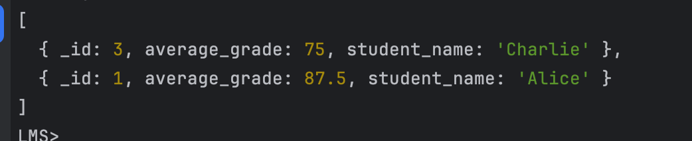

# Домашние задание по предмету *Базы Данных*

## PG

- Установить выбранную СУБД (MySQL или PostgreSQL) и создать базу данных с несколькими таблицами.
- Продумать и описать модель данных для простой информационной системы (например, система управления библиотекой,
  магазином, социальными сетями).

Модель данных LMS (PostgreSQL)

Основные сущности
- студент
- курс
- уведомление

Связи
- студент, курс - многие ко многим
- уведомление, студент - многие к одному

student

| column      | type         |
|-------------|--------------|
| id (PK)     | SERIAL       |
| name        | VARCHAR(100) |
| email       | VARCHAR(100) |
| enrolled_at | TIMESTAMP    |

courses

| column      | type         |
|-------------|--------------|
| id          | SERIAL       |
| name        | VARCHAR(200) |
| description | TEXT         |
| created_at  | TIMESTAMP    |

course_student

| column       | type      |
|--------------|-----------|
| id           | SERIAL    |
| student_id   | INT       |
| course_id    | course_id |
| progress     | INT       |
| completed_at | TIMESTAMP |

notifications

| column     | type      |
|------------|-----------|
| id         | SERIAL    |
| student_id | INT       |
| message    | TEXT      |
| sent_at    | TIMESTAMP |


[Создание таблиц](queries/create-tables.sql)

#### Базовые операции
[Создание](queries/base-operations/create.sql)\
[Изменение](queries/base-operations/update.sql)\
[Чтение](queries/base-operations/select.sql)\
[Удаление](queries/base-operations/delete.sql)

#### Транзакционные операции
[массовое создание пользователей](queries/transactional-operations/massive-migration.sql)

### Уведомление о успешном завершении курса
[функция](queries/functions/complete-course-notification.sql)

[триггер](queries/triggers/course-complete-trigger.sql)


### Уведомление о успешном добавлении на курс
[функция](queries/functions/course-registration-notification.sql)

[триггер](queries/triggers/course-registration-trigger.sql)

### Индесы
[созданные индексы](queries/indexes.sql)

### Логирование медленных запросов 
Для этого необходимо отредактировать `postgresql.conf`
```text
# Включаем логирование запросов
logging_collector = on

# Указываем минимальный порог для медленных запросов (например, 2 секунды)
log_min_duration_statement = 2000

# Логировать запросы в файл
log_directory = 'log'           # Папка для хранения логов
log_filename = 'slow_queries.log' # Имя файла лога


```

### Оптимизация запросов
Допустим у нас есть запрос который использует поиск по описанию курса
```sql 
SELECT id, name
FROM Courses
WHERE description LIKE '%quantum mechanics%';
```
Проблемы:
- LIKE '%...%' требует полного перебора строк, что неэффективно на больших данных.
- Индексы на текстовую колонку (например, B-Tree) не работают для подобных запросов.


Для решения подобных проблем используется обратный индекс [GIN](https://postgrespro.ru/docs/postgrespro/17/gin)
```postgres-sql
CREATE INDEX idx_courses_description_gin ON Courses USING GIN (to_tsvector('english', description));
```
Оптимизированный запрос
```
SELECT id, name
FROM Courses
WHERE to_tsvector('english', description) @@ to_tsquery('quantum & mechanics');
```


## Mongo
Поднимаем монгу 
```shell
docker-compose up -d 
```
Подключаемся к монге 
```shell
docker exec -it mongo-primary mongosh --username root --password example
```
Подключение к базе LMS
```shell
use LMS;
```


```shell
// Коллекция Users (Пользователи)
db.Users.insertMany([
  { _id: 1, name: "Alice", email: "alice@example.com", role: "student" },
  { _id: 2, name: "Bob", email: "bob@example.com", role: "instructor" },
  { _id: 3, name: "Charlie", email: "charlie@example.com", role: "student" }
]);

// Коллекция Courses (Курсы)
db.Courses.insertMany([
  { _id: 101, title: "Math 101", instructor: "Bob", credits: 3 },
  { _id: 102, title: "History 101", instructor: "Bob", credits: 2 },
  { _id: 103, title: "Physics 101", instructor: "Bob", credits: 4 }
]);

// Коллекция Enrollments (Записи на курсы)
db.Enrollments.insertMany([
  { user_id: 1, course_id: 101, status: "active" },
  { user_id: 1, course_id: 102, status: "active" },
  { user_id: 3, course_id: 103, status: "active" }
]);

// Коллекция Assignments (Задания)
db.Assignments.insertMany([
  { _id: 1, course_id: 101, title: "Homework 1", due_date: "2025-01-31" },
  { _id: 2, course_id: 102, title: "Essay 1", due_date: "2025-02-05" },
  { _id: 3, course_id: 103, title: "Lab Report 1", due_date: "2025-02-15" }
]);

// Коллекция Grades (Оценки)
db.Grades.insertMany([
  { user_id: 1, assignment_id: 1, grade: 85 },
  { user_id: 1, assignment_id: 2, grade: 90 },
  { user_id: 3, assignment_id: 3, grade: 75 }
]);

```

### Запросы для поиска, обновления и удаления данных

```shell
// Поиск студентов
db.Users.find({ role: "student" });

// Поиск курсов, которые ведет Bob
db.Courses.find({ instructor: "Bob" });

// Поиск всех записей на курс "Math 101":
db.Enrollments.find({ course_id: 101 });

// Обновить email пользователя Alice
db.Users.updateOne(
  { name: "Alice" },
  { $set: { email: "newalice@example.com" } }
);
  
// Удалить курс "History 101"
db.Courses.deleteOne({ title: "History 101" });


//Удалить все задания для курса с ID 101
db.Assignments.deleteMany({ course_id: 101 });
```

#### Агрегатные запросы

Рейтинг курсов (средняя оценка за все задания курса):
```shell
db.Grades.aggregate([
  {
    $lookup: {
      from: "Assignments",
      localField: "assignment_id",
      foreignField: "_id",
      as: "assignment_info"
    }
  },
  {
    $unwind: "$assignment_info"
  },
  {
    $group: {
      _id: "$assignment_info.course_id",
      average_grade: { $avg: "$grade" }
    }
  },
  {
    $lookup: {
      from: "Courses",
      localField: "_id",
      foreignField: "_id",
      as: "course_info"
    }
  },
  {
    $unwind: "$course_info"
  },
  {
    $project: {
      course_title: "$course_info.title",
      average_grade: 1
    }
  }
]);
```
Результат


Прогресс студентов (средний балл каждого студента):
```shell
db.Grades.aggregate([
  {
    $group: {
      _id: "$user_id",
      average_grade: { $avg: "$grade" }
    }
  },
  {
    $lookup: {
      from: "Users",
      localField: "_id",
      foreignField: "_id",
      as: "student_info"
    }
  },
  {
    $unwind: "$student_info"
  },
  {
    $project: {
      student_name: "$student_info.name",
      average_grade: 1
    }
  }
]);
```
Результат


### Создание индексов для коллекций Users и Courses
Индекс для коллекции Users (по имени):
```shell
db.Users.createIndex({ name: 1 });
```
Индекс для коллекции Courses (по названию курса и преподавателю):
```shell
db.Courses.createIndex({ title: 1 });
db.Courses.createIndex({ instructor: 1 });
```
Результат


### Репликация 

Создание ключа безопасности для репликации
```shell
openssl rand -base64 756 > mongo/mongodb-keyfile
chmod 400 mongo/mongodb-keyfile
```

Стартуем контейнеры `docker-compose up`\
Подключаемся к Primary контейнеру
```shell
docker exec -it mongo-primary mongosh -u root -p example --authenticationDatabase admin
```
Выполним команду для инициализации репликационного набора
```shell
rs.initiate({
  _id: "rs0",
  members: [
    { _id: 0, host: "mongo-primary:27017" },
    { _id: 1, host: "mongo-secondary:27017" },
    { _id: 2, host: "mongo-arbiter:27017", arbiterOnly: true }
  ]
});
```
Получим статус репликации
```shell
rs0 [direct: secondary] test> rs.status();
{
  set: 'rs0',
  date: ISODate('2025-01-25T21:42:15.285Z'),
  myState: 1,
  term: Long('1'),
  syncSourceHost: '',
  syncSourceId: -1,
  heartbeatIntervalMillis: Long('2000'),
  majorityVoteCount: 2,
  writeMajorityCount: 2,
  votingMembersCount: 3,
  writableVotingMembersCount: 2,
  optimes: {
    lastCommittedOpTime: { ts: Timestamp({ t: 1737841331, i: 1 }), t: Long('1') },
    lastCommittedWallTime: ISODate('2025-01-25T21:42:11.912Z'),
    readConcernMajorityOpTime: { ts: Timestamp({ t: 1737841331, i: 1 }), t: Long('1') },
    appliedOpTime: { ts: Timestamp({ t: 1737841331, i: 1 }), t: Long('1') },
    durableOpTime: { ts: Timestamp({ t: 1737841331, i: 1 }), t: Long('1') },
    writtenOpTime: { ts: Timestamp({ t: 1737841331, i: 1 }), t: Long('1') },
    lastAppliedWallTime: ISODate('2025-01-25T21:42:11.912Z'),
    lastDurableWallTime: ISODate('2025-01-25T21:42:11.912Z'),
    lastWrittenWallTime: ISODate('2025-01-25T21:42:11.912Z')
  },
  lastStableRecoveryTimestamp: Timestamp({ t: 1737841291, i: 1 }),
  electionCandidateMetrics: {
    lastElectionReason: 'electionTimeout',
    lastElectionDate: ISODate('2025-01-25T21:41:41.851Z'),
    electionTerm: Long('1'),
    lastCommittedOpTimeAtElection: { ts: Timestamp({ t: 1737841291, i: 1 }), t: Long('-1') },
    lastSeenWrittenOpTimeAtElection: { ts: Timestamp({ t: 1737841291, i: 1 }), t: Long('-1') },
    lastSeenOpTimeAtElection: { ts: Timestamp({ t: 1737841291, i: 1 }), t: Long('-1') },
    numVotesNeeded: 2,
    priorityAtElection: 1,
    electionTimeoutMillis: Long('10000'),
    numCatchUpOps: Long('0'),
    newTermStartDate: ISODate('2025-01-25T21:41:41.901Z'),
    wMajorityWriteAvailabilityDate: ISODate('2025-01-25T21:41:42.400Z')
  },
  members: [
    {
      _id: 0,
      name: 'mongo-primary:27017',
      health: 1,
      state: 1,
      stateStr: 'PRIMARY',
      uptime: 175,
      optime: { ts: Timestamp({ t: 1737841331, i: 1 }), t: Long('1') },
      optimeDate: ISODate('2025-01-25T21:42:11.000Z'),
      optimeWritten: { ts: Timestamp({ t: 1737841331, i: 1 }), t: Long('1') },
      optimeWrittenDate: ISODate('2025-01-25T21:42:11.000Z'),
      lastAppliedWallTime: ISODate('2025-01-25T21:42:11.912Z'),
      lastDurableWallTime: ISODate('2025-01-25T21:42:11.912Z'),
      lastWrittenWallTime: ISODate('2025-01-25T21:42:11.912Z'),
      syncSourceHost: '',
      syncSourceId: -1,
      infoMessage: 'Could not find member to sync from',
      electionTime: Timestamp({ t: 1737841301, i: 1 }),
      electionDate: ISODate('2025-01-25T21:41:41.000Z'),
      configVersion: 1,
      configTerm: 1,
      self: true,
      lastHeartbeatMessage: ''
    },
    {
      _id: 1,
      name: 'mongo-secondary:27017',
      health: 1,
      state: 2,
      stateStr: 'SECONDARY',
      uptime: 43,
      optime: { ts: Timestamp({ t: 1737841331, i: 1 }), t: Long('1') },
      optimeDurable: { ts: Timestamp({ t: 1737841331, i: 1 }), t: Long('1') },
      optimeWritten: { ts: Timestamp({ t: 1737841331, i: 1 }), t: Long('1') },
      optimeDate: ISODate('2025-01-25T21:42:11.000Z'),
      optimeDurableDate: ISODate('2025-01-25T21:42:11.000Z'),
      optimeWrittenDate: ISODate('2025-01-25T21:42:11.000Z'),
      lastAppliedWallTime: ISODate('2025-01-25T21:42:11.912Z'),
      lastDurableWallTime: ISODate('2025-01-25T21:42:11.912Z'),
      lastWrittenWallTime: ISODate('2025-01-25T21:42:11.912Z'),
      lastHeartbeat: ISODate('2025-01-25T21:42:13.922Z'),
      lastHeartbeatRecv: ISODate('2025-01-25T21:42:14.917Z'),
      pingMs: Long('0'),
      lastHeartbeatMessage: '',
      syncSourceHost: 'mongo-primary:27017',
      syncSourceId: 0,
      infoMessage: '',
      configVersion: 1,
      configTerm: 1
    },
    {
      _id: 2,
      name: 'mongo-arbiter:27017',
      health: 1,
      state: 7,
      stateStr: 'ARBITER',
      uptime: 43,
      lastHeartbeat: ISODate('2025-01-25T21:42:13.921Z'),
      lastHeartbeatRecv: ISODate('2025-01-25T21:42:13.921Z'),
      pingMs: Long('0'),
      lastHeartbeatMessage: '',
      syncSourceHost: '',
      syncSourceId: -1,
      infoMessage: '',
      configVersion: 1,
      configTerm: 1
    }
  ],
  ok: 1,
  '$clusterTime': {
    clusterTime: Timestamp({ t: 1737841331, i: 1 }),
    signature: {
      hash: Binary.createFromBase64('7QXwi0ZdYrIObY03hjoFgsRTf14=', 0),
      keyId: Long('7463971553433092101')
    }
  },
  operationTime: Timestamp({ t: 1737841331, i: 1 })
}
rs0 [direct: primary] test> 
```

Запишем данные в мастер 
```shell
use LMS;
rs0 [direct: primary] test> use LMS;
switched to db LMS
rs0 [direct: primary] LMS> db.testCollection.insert({ name: "test", created_at: new Date() });
DeprecationWarning: Collection.insert() is deprecated. Use insertOne, insertMany, or bulkWrite.
{
  acknowledged: true,
  insertedIds: { '0': ObjectId('67955b0d43bbfa8cd2fc0421') }
}
```

Подключимся к реплике 
```shell
docker exec -it mongo-secondary mongosh -u root -p example --authenticationDatabase admin
```
Убедимся что данные доставлены до реплики
```shell
rs0 [direct: secondary] test> use LMS;
switched to db LMS
rs0 [direct: secondary] LMS> db.testCollection.find();
[
  {
    _id: ObjectId('67955b0d43bbfa8cd2fc0421'),
    name: 'test',
    created_at: ISODate('2025-01-25T21:43:41.159Z')
  }
]
```
